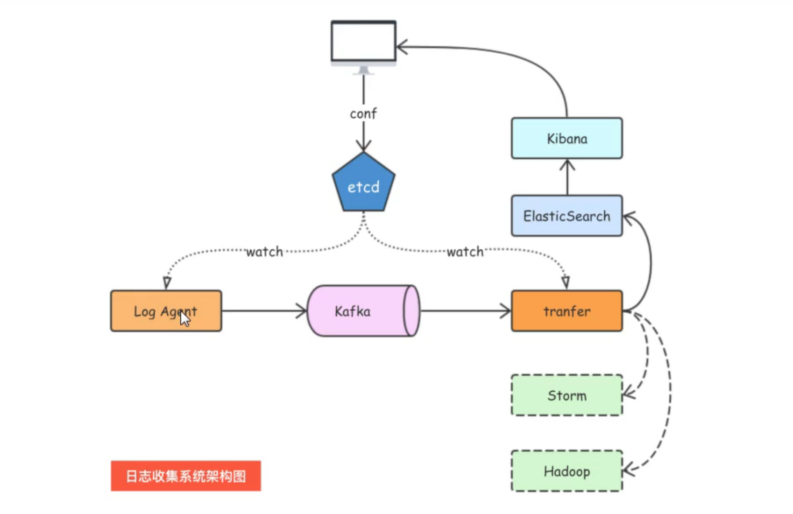

# -goroutine-
## 简介
go并发编程的练手项目

## 项目背景
一般来说业务系统都有自己的日志,当系统出现问题时,我们一般需要通过日志信息来定位与解决问题，当系统机器较少时我们可以登录服务器来查看,但是当系统机器较多时,我们通过服务器来查看日志的成本就会变得很大,这时候我们需要通过日志来查看,但是由于日志量比较大,我们无法通过服务器来查看,这时候我们需要通过日志收集系统来解决这个问题。

## 解决方案
我们可以将机器上的日志实时收集，统一的存储到中心系统，对这些日志建立索引，通过搜索快速定位日志记录，通过提供界面友好的Web页面实现日志的检索与展示.

## 项目架构图

## 相关组件
- kafka消息队列