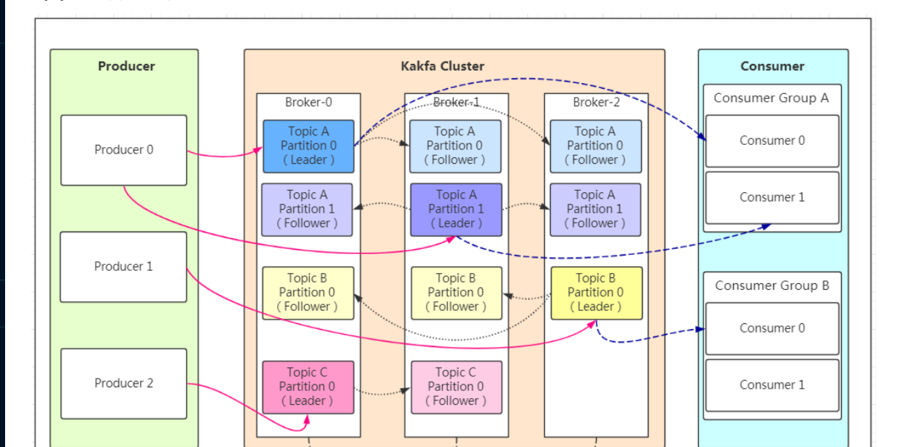
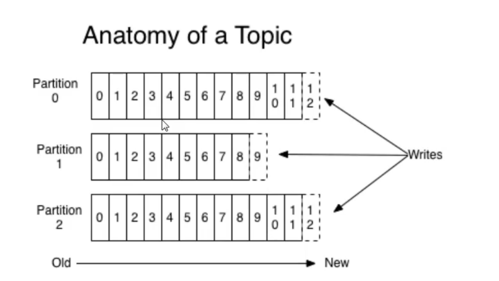
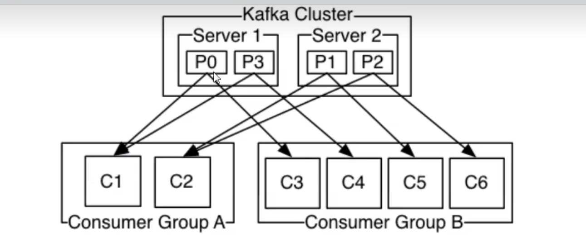

# 消息队列的通信模式

## 点对点模式
消息生产者生产消息发送到消息队列(queue),消费者从queue中取出并且消费信息，而这条信息被消费后queue中就没有了这条信息，不存在重复消费

## 发布/订阅
- 基本概念
发布者发布消息发送到消息队列(topic),订阅者从topic中取出并且消费信息，而这条信息被消费后topic中还存在这条信息，存在重复消费
- 补充
在发布订阅模式下，发布者信息量很大时，显然单个订阅者的消费能力是不够的，在实际应用中往往是通过多个订阅者组成一个订阅组来负载均衡消费topic信息
也就是分组订阅，这样订阅者就可以较容易的实现消费能力的线性拓展。可以看做一个topic下有多个queue，每个queue都实现点对点的的消费模式，而Queue
之间是发布/订阅模式

# Kafka

## 什么是Kafka
Kafka是Apache基金会的一个开源项目，是一个分布式的、可扩展的、高吞吐的、高可用的分布式数据流平台,既可以运行在单台服务器上,也可以在多台服务器
上形成集群，我们既可以发送数据到集群中的任意一台服务器,也可以从集群中的任意一台服务器中读取数据。Kafka可以保证数据不丢失,并且可以做到高可用,
类似与消息队列。

## Kafka的基本架构

### 有关名词的解释
- Producer: 消息生产者,负责向Kafka集群发送消息
- Consumer: 消息消费者,负责从Kafka集群中读取消息
- Topic: Kafka集群中的消息主题,可以理解为消息队列,每个Topic可以有多个Partition,每个Partition可以有多个Replica,每个Replica可以有多个
Broker
- Broker: Broker是kafka实例，每个服务器上有一个或多个kafka的实例，我们姑且认为每个broker对应一台服务器。每个kafka集群内的broker都有一
个不重复的编号
- Partition: Topic的分区，每个topic可以有多个分区，分区的作用是做负载，提高kafka的吞吐量。同一个topic在不同的分区的数据是不重复的，
partition的表现形式就是一个一个的文件夹
- Replication:每一个分区都有多个副本，副本的作用是做备胎。当主分区（Leader）故障的时候会选择一个备胎（Follower）上位，成为Leader。 在
kafka中默认副本的最大数量是10个，且副本的数量不能大于Broker的数量，follower和leader绝对是在不同的机器，同一机器对同一个分区也只可能存放
一个副本（包括自己）。
- Consumer Group：我们可以将多个消费组组成一个消费者组，在kafka的设计中同一个分区的数据只能被消费者组中的某一个消费者消费。同一个消费者组的
消费者可以消费同一个topic的不同分区的数据，这也是为了提高kafka的吞吐量！

参考文章:
[Kafka基本原理](https://blog.csdn.net/weixin_45366499/article/details/106943229)

## KafKa的工作机制

### 工作流程
- 生产者从KafKa集群中获取分区leader信息
- 生产者将消息发送到leader上
- leader将消息写入到本地磁盘中
- follower从leader处拉取消息数据
- follower将消息写入到本地磁盘中,完成后发送ACK给leader
- leader收到所有follower的ACK后向生产者发送ACK

### patition的选择原则
在Kafka中,可能会存在某个topic有多个patition,这时候我们应该如何去选择partition？这时候我们一般会遵循以下原则:
- 我们在写入partition时可以指定需要写入的partition，如果指定则写入对应的parttion
- 如果没有指定partition，但是我们设置了数据的key,则使用hash算法计算出对应的partition
- 如果没有指定partition，也没有设置key，则采取轮询方式,每次取一小段时间的数据写入一个partition，下一次取下一段时间的数据写入下一个partition

### ACK应答机制
生产者在往Kafka内写入数据的时候，可以设置参数来确定KafKa是否接收到了数据，这个参数取值可以是`0`,`1`,`all`
- 0: 不应答，生产者不等待Kafka的应答，生产者发送完数据就认为数据写入成功，安全性最低但是效率最高
- 1: 生产者向KafKa内发送数据只要leader应答就可以发送下一条，只确保leader发送成功
- all: 生产者向KafKa内发送数据需要leader和follower都应答才可以发送下一条，确保数据写入成功并且索引的副本都完成备份。
**注意**:
如果往不存在的topic写入数据，那么kafka会自动创建topic，但是这个topic的分区和副本数量都是默认的1个，如果要设置成多个分区，需要提前创建topic。

### Topic和数据日志
`topic`是统一类别的消息记录(record)的集合.在Kafka中，一个`topic`往往会有多个订阅者，对于每一个主题，Kafka集群都会维护一个分区数据日志:

每一个`partition`都是一个有序且不可变的消息记录集合。当有新的数据写入的时候，就会被添加到partition的末尾，在每一个partition中,每条消息都
会被翻倍一个顺序的唯一标识，这个标识就是`offset`(偏移量)。当消费者消费数据的时候，会记录下自己消费到的`offset`，当消费者断开连接的时候，会
记录下断开连接的`offset`.
**注意**:Kafka只保证在同一个partition内部消息是有序的,不同partition之间是无法保证有序的。

Kafka可以配置一个保留期限来标识日志在集群中的有效期，超过这个期限的日志会被删除。

### Partition结构
Partition在服务器上的表现形式是一个个的文件夹，在每个Partition的文件夹下面会有多组segement文件,每组segement文件包含存储message的`.log`
文件，还有用于检索消息的索引文件`index`和`timeindex`。

### 消费数据
多个消费者实例可以组成一个消费者组，并且用标签来区分不同的消费者组，一个消费者组中的不同消息者实例可以运行在不同的进程甚至不同的服务器上 如果
所有的消费者实例都在同一个消费者组上,那么消息记录将被平均分配给消费者实例。如果消费者实例都在不同的消费者组上，那么每一条消息记录会被广播到每
一个消费者实例.
示例:

举个例子，如上图所示一个两个节点的Kafka集群上拥有一个四个partition (PO-P3)的topic。有两个 消费者组都在消费这个topic中的数据，消费者组A有
两个消费者实例，消费者组B有四个消费者实例。从图中我们可以看到，在同一个消费者组中，每个消费者实例可以消费多个分区，但是每个分区最多只 能被消费
者组中的一个实例消费.也就是说，如果有一个4个分区的主题，那么消费者组中最多只能有4 个消费者实例去消费，多出来的都不会被分配到分区。其实这也很好
理解，如果允许两个消费者实例同 时消费同一个分区，那么就无法记录这个分区被这个消费者组消费的offset了。如果在消费者组中动态的上线或下线消费者，
那么Kafka集群会自动调整分区与消费者实例间的对应关系

## Kafka的使用场景
- 消息队列
- 追踪网站的追踪
- 日志聚合