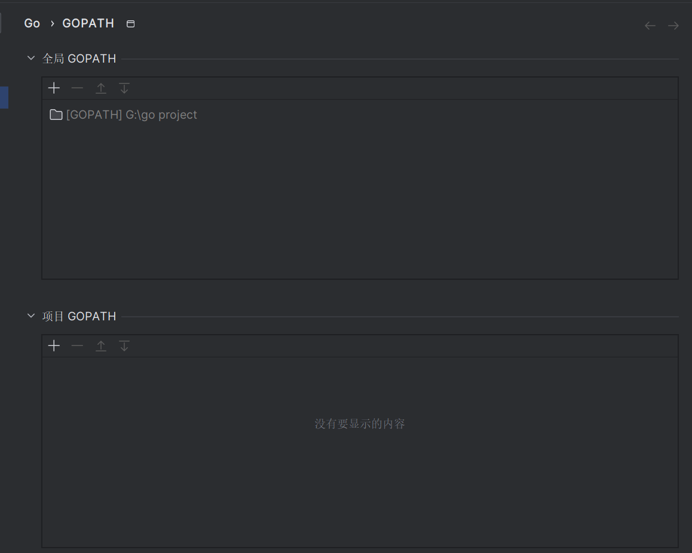
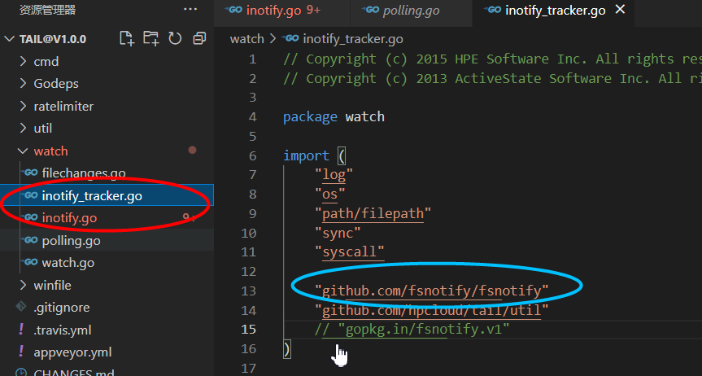
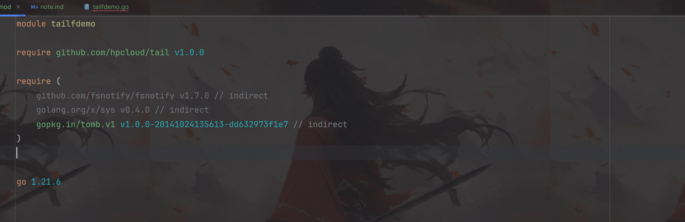
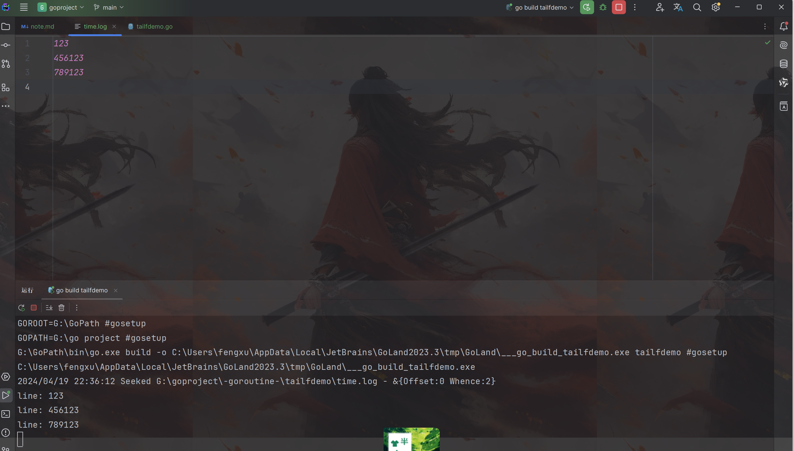

# Linux中的tail命令
tail 命令是一个在 Unix/Linux 操作系统上用来显示文件末尾内容的命令。它可以显示文件的最后几行内容，默认情况下显示文件的最后 10 行。tail 命令
非常有用，特别是在我们查看日志文件或者监视文件变化时。
基本用法如下：
tail [选项]... [文件]...
一些常用的选项包括：
- -n <行数>：显示指定行数的末尾内容。例如，tail -n 20 filename 将显示文件 filename 的最后 20 行。
- -f：在文件末尾持续输出内容，常用于查看日志文件实时变化。使用 Ctrl + C 终止。
- -c <字节数>：显示指定字节数的末尾内容。例如，tail -c 100 filename 将显示文件 filename 的最后 100 个字节。

# tail包简介
go语言中tail包用于输出文件的最后几行。假设该档案有更新，tail会自己主动刷新，确保我们看到是最新的档案内容 ，在日志收集中可以实时的监测日志的变
化。

## 下载tail包
tail包的地址为:

`github.com/hpcloud/tail`

但是这里直接执行的话会报错

`PS G:\goproject\-goroutine-\tailfdemo> go get github.com/hpcloud/tail
go: gopkg.in/fsnotify.v1@v1.4.9: go.mod has non-....v1 module path "github.com/fsnotify/fsnotify" at revision v1.4.9`,
这个主要是因为tail包中有依赖包的名字修改了，所以我们也要做对应的修改:
- 首先，打开设置，找到自己的GoPath路径:

- 然后到路径下找到tail包:

- 最后对tail代码目录下的inotify.go和inotify_tracker.go两个文件，

将gopkg.in/fsnotify/fsnotify.v1 修改为 github.com/fsnotify/fsnotify， 然后再执行go mod tidy 命令即可。


- 加载成功:



# tail包相关函数及结构体

## TailFile函数
```go
func TailFile(filename string, config Config) (*Tail, error) {
}
```
tail2.TailFile()函数的参数是文件路径和配置文件，会生成一个Tail结构体。在Tail结构体中，最重要的属性是文件名Filename和用于存储文件一行Line
的通道Lines:
```go
type Tail struct {
Filename string
Lines    chan *Line
Config

file   *os.File
reader *bufio.Reader

watcher watch.FileWatcher
changes *watch.FileChanges

tomb.Tomb // provides: Done, Kill, Dying

lk sync.Mutex
}

type Line struct{  //用来存储每一行日志
	Text string
	Time time.Time
	Err error
}
```
除此之外，还有一个结构体`Config`用来配置tail2.TailFile()函数的参数:
```go
type Config struct {
// File-specifc
Location    *SeekInfo // Seek to this location before tailing
ReOpen      bool      // Reopen recreated files (tail -F)
MustExist   bool      // Fail early if the file does not exist
Poll        bool      // Poll for file changes instead of using inotify
Pipe        bool      // Is a named pipe (mkfifo)
RateLimiter *ratelimiter.LeakyBucket

// Generic IO
Follow      bool // Continue looking for new lines (tail -f)
MaxLineSize int  // If non-zero, split longer lines into multiple lines

// Logger, when nil, is set to tail.DefaultLogger
// To disable logging: set field to tail.DiscardingLogger
Logger logger
}
```
下面是对一些参数的说明:
- Location *SeekInfo: 指定文件的起始读取位置。SeekInfo 是一个指针类型，可能包含文件偏移等信息。

- ReOpen bool: 是否重新打开已经被重新创建的文件。当文件被重新创建时（比如通过 tail -F 命令监视日志文件时），如果设置为 true，则重新打开该文件，继续读取新内容。

- MustExist bool: 如果文件不存在是否立即报错。当设置为 true 时，如果文件不存在，则会立即报错而不是等待文件出现。

- Poll bool: 是否使用轮询的方式检查文件变化，而不是使用 inotify。在一些系统上，inotify 可能不可用或者不够稳定，此时可以通过设置为 true 来强制使用轮询方式。

- Pipe bool: 是否为命名管道（mkfifo）。如果文件是通过 mkfifo 命令创建的命名管道，则设置为 true。

- RateLimiter *ratelimiter.LeakyBucket: 速率限制器，用于限制文件读取的速率。ratelimiter.LeakyBucket 可能是一个实现了漏桶算法的速率限制器，用于控制读取速度。

- Follow bool: 是否继续监视文件的新内容（类似于 tail -f 命令）。如果设置为 true，则会持续监视文件，并读取新的行内容。

- MaxLineSize int: 如果非零，表示最大的行长度。如果读取到的行长度超过该值，则会将其分割成多个行。

- Logger logger: 日志记录器，用于记录文件读取过程中的日志信息。如果设置为 nil，则会使用默认的日志记录器（tail.DefaultLogger）。如果想禁用日志记录，则可以将该字段设置为 tail.DiscardingLogger。

# tail读取日志文件的代码样例;
- 代码
```go
package main

import (
	"fmt"
	"github.com/hpcloud/tail"
	"time"
)

func main() {
	filename := "G:\\goproject\\-goroutine-\\tailfdemo\\time.log"
	config := tail.Config{
		Follow:    true,  //进行跟随
		ReOpen:    true,  //重新打开
		MustExist: false, //文件打开失败不报错
		Poll:      true,
		Location:  &tail.SeekInfo{Offset: 0, Whence: 2},
	}
	tail, err := tail.TailFile(filename, config)
	if err != nil {
		fmt.Println("tail file failed,err:", err)
		return
	}
	for {
		line, ok := <-tail.Lines
		if !ok {
			fmt.Println("tail file close reopen, filename: ", tail.Filename)
			time.Sleep(1 * time.Second)
			continue
		}
		fmt.Println("line:", line.Text)
	}
}
```
这里我们输入log文件中，输出控制台就会实时更新了:


# 总结
- 流程:
    - 首先定义Config结构体，初始化配置文件
    - 利用TailFile函数得到Tail结构体，Tail结构体中的Lines封装了拿到的信息
    - 循环遍历Tail.Lines，取出信息，可以实现实时监控